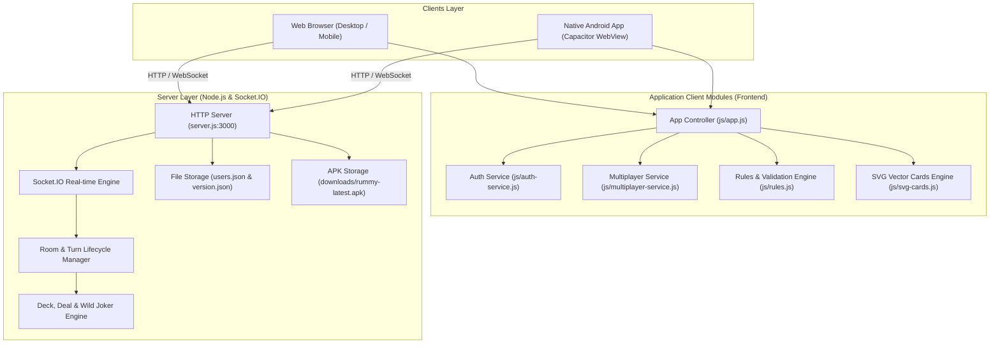

# Indian Rummy Multiplayer Game - Comprehensive Architecture & System Overview

## 1. Project Overview

**Indian Rummy Multiplayer** is a real-time, cross-platform multiplayer card game application implementing official 13-Card Indian Rummy rules. The platform is architected to operate seamlessly across both **Web Browsers (Desktop & Mobile)** and native **Android Devices (via Capacitor & APK distribution)**.

### Key Highlights
- **Real-Time Multiplayer**: Built with Node.js and Socket.IO for low-latency state synchronization across concurrent game rooms.
- **Dual Platform Support**: Single codebase rendering responsive web views while packaging into native Android APKs via Capacitor.
- **Game Modes**:
  - **Casual Private / Custom Rooms**: Players can create and join customizable rooms with 4-digit codes, selectable deck counts (1, 2, or 3 decks), turn timers (30s, 45s, 60s, 90s), and custom coin entry stakes.
  - **Tournament / Public Tables (e.g., Room `9999`)**: Multi-player scheduled match tables with automated player matching, rotating first-turn priority, pot distribution, and auto-start logic.
- **Official Rules Engine**:
  - Pure Sequence validation (consecutive cards of the same suit with no joker substitutes).
  - Impure Sequence validation (with Wild Jokers and Printed Jokers).
  - Valid Sets / Triplets check.
  - Special Hand: **All Triplets** (13-card natural triplet hand with double-win bonuses).
  - Penalty point computation (0–80 points) for unfinished hands on declaration.
- **User Economy & Auth System**:
  - Lightweight file-backed JSON user registry (`users.json`).
  - Account registration, login, profile custom avatar photos, and coin balance tracking.
  - Free coin refills when balance drops below room entry stakes.
- **Automated Android Build & OTA/Direct APK Distribution**:
  - Automated APK packaging script (`scripts/build-apk.js`) with dynamic LAN IP detection and auto-incrementing version codes.
  - Built-in in-app update prompts and direct APK download endpoints (`/api/download_apk`).

---

## 2. System Architecture

The overall system follows a client-server architecture with dual transport layers (REST API for static transactions and Socket.IO WebSockets for real-time game state synchronization).



---

## 3. Directory & File Structure

```
indian-rummay-game/
├── android/                   # Android native project files (Gradle, Android Studio wrapper)
├── assets/                    # Static image/media assets & icons
├── downloads/                 # Download directory holding built APKs (rummy-latest.apk)
├── js/                        # Frontend JavaScript modules
│   ├── app.js                 # Primary game UI controller, event handlers, drag-drop, rendering
│   ├── auth-service.js        # User authentication, token & session persistence, profile management
│   ├── config.js              # Auto-generated runtime network configuration (SERVER_URL)
│   ├── multiplayer-service.js # Socket.IO client interface, event listeners, fallback REST APIs
│   ├── rules.js               # Client-side Rummy rules engine (Pure/Impure sequences, sets, scoring)
│   ├── socket.io.min.js       # Bundled Socket.IO client library
│   └── svg-cards.js           # Dynamic vector SVG playing cards generator
├── scripts/
│   └── build-apk.js           # Automated Android APK compilation, version incrementer & LAN IP detector
├── capacitor.config.json      # Capacitor runtime configuration
├── index.html                 # Main Single Page Application (SPA) HTML layout
├── package.json               # Project manifest, dependencies, and build scripts
├── server.js                  # Core Node.js HTTP & Socket.IO multiplayer game server
├── splash.png                 # Mobile splash screen asset
├── style.css                  # Custom styling, felt board gradients, animations & responsive layout
├── users.json                 # Persistent database of registered users and coin balances
├── version.json               # Build versioning manifest for app updates
└── www/                       # Compiled/synced web assets targeted by Capacitor for Android APK
```

---

## 4. Module Breakdown & Technical Details

### 4.1. Backend Server (`server.js`)
- **Technology**: Node.js standard `http` library + `socket.io` (v4.7.5).
- **Core Responsibilities**:
  - **Static Asset Delivery**: Serves SPA assets (`index.html`, `style.css`, scripts, vector icons) and manages CORS.
  - **REST API Endpoints**:
    - `POST /api/register` & `POST /api/login`: Authentication and user management.
    - `POST /api/get_profile` & `POST /api/update_settings`: User profile retrieval and customization.
    - `GET /api/version` & `GET /api/download_apk`: App update checks and APK serving.
    - `POST /api/create_room`, `POST /api/join_room`, `POST /api/get_rooms`: Fallback REST room operations.
  - **Socket.IO Real-Time Events**:
    - `create_room`, `join_room`, `leave_room`, `kick_player`
    - `start_game`, `restart_round`
    - `draw_card` (from draw pile or open discard pile)
    - `discard_card` (triggers turn rotation, timer reset, timeout handling)
    - `declare_game` (validates hands across players, distributes pot coins, awards winner)
    - `drop_game` (first drop / middle drop penalty handling)
  - **Room State Management**:
    - In-memory `activeRooms` dictionary with support for multiple simultaneous rooms.
    - Automated turn timeouts and player inactivity penalties.
    - Round rotation logic to cycle the starting player in successive rounds.

### 4.2. Rules & Validation Engine (`js/rules.js` & `server.js`)
- **Deck Setup**: Configurable 1 to 3 standard 52-card decks + 2 printed Jokers per deck.
- **Wild Joker**: A random card cut from the deck whose rank acts as wild joker across all suits.
- **Hand Validation Hierarchy**:
  1. **All Triplets (Special Hand)**: Hand consisting of 4 valid natural sets/triplets of 3–4 cards without jokers.
  2. **Standard Rummy Hand**:
     - At least **1 Pure Sequence** (no jokers used as substitutes).
     - At least **2 Sequences total** (1 Pure + 1 Impure or second Pure).
     - Remaining cards grouped into valid sequences or sets.
- **Scoring**:
  - Winning declaration: `0` penalty points.
  - Unarranged cards scored by standard pip values (`A, K, Q, J, 10` = 10 pts; number cards = face value; Jokers = 0 pts).
  - Maximum penalty capped at **80 points**.

### 4.3. Client Architecture & UI Controller (`js/app.js` & `index.html`)
- **Single Page Application (SPA)** with distinct responsive view states:
  - **Auth Screen**: Login & Registration forms with APK download banner.
  - **Lobby Screen**: Active rooms list, Create Room modal, Join by 4-digit code, Tournament entry.
  - **Game Table Screen**:
    - Felt-textured playing surface with gold borders and ambient glow.
    - Top info bar: Room code, Round number, Pot coins, Wild Joker indicator, Discard & Draw piles with interactive tap/drag.
    - Opponent player seats: Status indicators, active turn rings, countdown timers, and card counts.
    - Hero player hand area: Multi-group card layout, drag-and-drop grouping, card selection, sorting (by suit or rank), manual grouping, Declare, and Drop action buttons.
  - **Declaration / Winner Modal**: Detailed breakdown of winner hand, opponent melds, penalty points, and coin prize distribution.
  - **Settings & Profile Modal**: Server URL configuration, custom avatar selector, password changes.

### 4.4. Network Synchronization (`js/multiplayer-service.js`)
- Dynamic endpoint resolution (Local Storage override -> `APP_CONFIG.SERVER_URL` -> Window Origin -> Fallback IP).
- Automated reconnection handling with backoff.
- Multi-callback subscriber pattern for room updates, declarations, and lobby refreshes.

---

## 5. Build, Packaging & Deployment Pipeline

### 5.1. Automated Android APK Build (`scripts/build-apk.js`)
1. **Network Discovery**: Inspects host network interfaces to detect active LAN IPv4 address (e.g., `192.168.x.x`).
2. **Configuration Generation**: Writes detected IP into `js/config.js` so mobile devices automatically reach the host server.
3. **Version Increment**: Bumps `versionCode` and `buildNumber` in `version.json` and updates `android/app/build.gradle`.
4. **Asset Synchronization**: Copies web root (`index.html`, `style.css`, `js/`) to `www/` and executes `npx cap sync android`.
5. **Gradle Compilation**: Invokes the embedded/system JDK 17 and Gradle wrapper (`./gradlew assembleDebug`) to produce `app-debug.apk`.
6. **Artifact Staging**: Copies the finished APK to `downloads/rummy-latest.apk` for server distribution.

---

## 6. How to Run & Develop

### Prerequisites
- Node.js (v16+)
- JDK 17 (included in `jdk17/` or system Java)
- Android SDK / Command-line Tools (for building native APKs)

### Commands
```bash
# 1. Install dependencies
npm install

# 2. Start Game Server
npm start
# Server starts on http://0.0.0.0:3000

# 3. Build & Sync Web Assets for Capacitor
npm run build

# 4. Compile Android APK automatically
npm run build:apk
```
